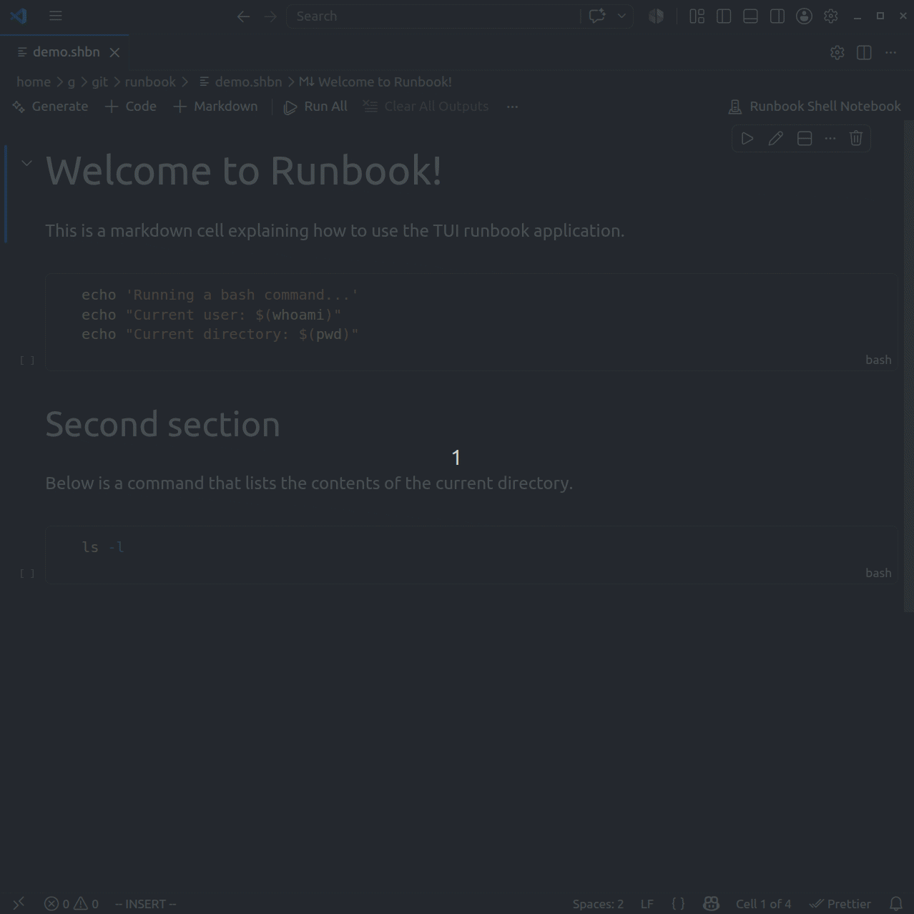

# vscode-runbook

A Visual Studio Code extension for interactive shell notebooks (.shbn), based on the runbook TUI application.


## getting started

```sh
code --install-extension vscode-runbook-0.1.0.vsix
```

Open a .shbn file in VS Code and you should see the Runbook editor.



## development

```bash
# install dependencies
npm install

# build the extension
npm run vsce-package

# install the extension
code --install-extension vscode-runbook-0.1.0.vsix
```
